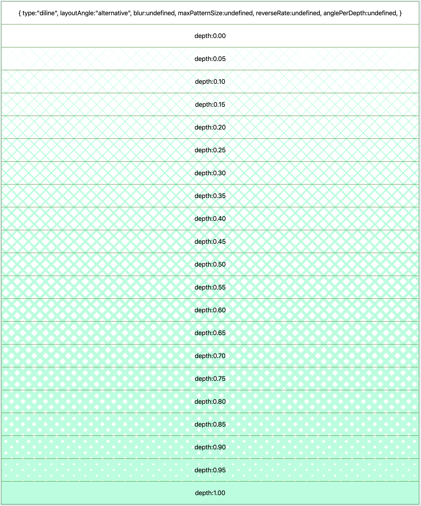

# flounder.style.js

Digital color depth pattern style maker for TypeScript/JavaScript

## Features

This library provides CSS for expressing percentages by area of ​​a color pattern instead of color intensity.

Expressions based on color density can be difficult to recognize, not only for colorblind people, but also for people who are not colorblind. In addition, the expression of subtle hues based on color density is strongly affected by the color development of the display, and in the user environment, the colors may appear quite different from the intended hues.

These problems can be avoided by using color pattern expressions.

## Redering CSS Sample

```css
background-image:
    radial-gradient(circle, rgb(170, 255, 221) 8px, transparent 8px),
    radial-gradient(circle, rgb(170, 255, 221) 8px, transparent 8px),
    radial-gradient(circle, rgb(170, 255, 221) 8px, transparent 8px),
    radial-gradient(circle, rgb(170, 255, 221) 8px, transparent 8px);
background-size: 43.1px 37.32px;
background-position: 0px 0px, 21.55px 0px, 10.77px 18.66px, 32.32px 18.66px;
```

( Line breaks and indentation have been adjusted for ease of viewing, and the CSS that is actually created will not have line breaks and indentation adjusted like this. )

## Redering Samples





## How to install for your project by npm

```sh
npm install @wraith13/flounder.style.js --save
```

## How to use

```typescript
import { flounderStyle } from "flounder.style.js";

// make style list
const data: flounderStyle.Arguments =
{
    type: "tri",
    layoutAngle: "regular",
    foregroundColor: "#AAFFDD",
    spotIntervalSize: 24,
    depth: 0.5,
};
const styleList = flounderStyle.makePatternStyleList(data);

// apply style list
const element = document.getElementById("YOUR-ELEMENT");
flounderStyle.setStyleList(element, styleList);

// get CSS string
console.log(`CSS: ${flounderStyle.styleListToString(styleList)}`);
```

### flounderStyle.Arguments

|key|type|default|description|
|---|---|---|---|
|type|FlounderType|"try"|"try" or "tetra"|
|layoutAngle|LayoutAngle|"regular"|"regular" or "alternative"|
|foregroundColor|Color|`NOT OPTIONAL`|Pattern foreground [CSS Color](https://developer.mozilla.org/en-US/docs/Web/CSS/color_value)|
|backgroundColor|Color|"transparent"|Pattern background [CSS Color](https://developer.mozilla.org/en-US/docs/Web/CSS/color_value)|
|spotIntervalSize|number|24|...|
|depth|number|`NOT OPTIONAL`|must be 0.0 <= depth and depth <= 1.0|
|maxSpotSize|number|`undefined`|must be 1 <= maxSpotSize and maxSpotSize <= (spotIntervalSize *0.5)|
|maximumFractionDigits|number|2|...|

## Development environment construction

0. Install [Visual Studio Code](https://code.visualstudio.com/) ( Not required, but recommended. )
1. Install [Node.js](https://nodejs.org/)
2. Execute `npm install`.

## How to build

requires: [Node.js](https://nodejs.org/), [TypeScript Compiler](https://www.npmjs.com/package/typescript)

`tsc -P .` or `tsc -P . -w`

## License

[Boost Software License](./LICENSE_1_0.txt)
